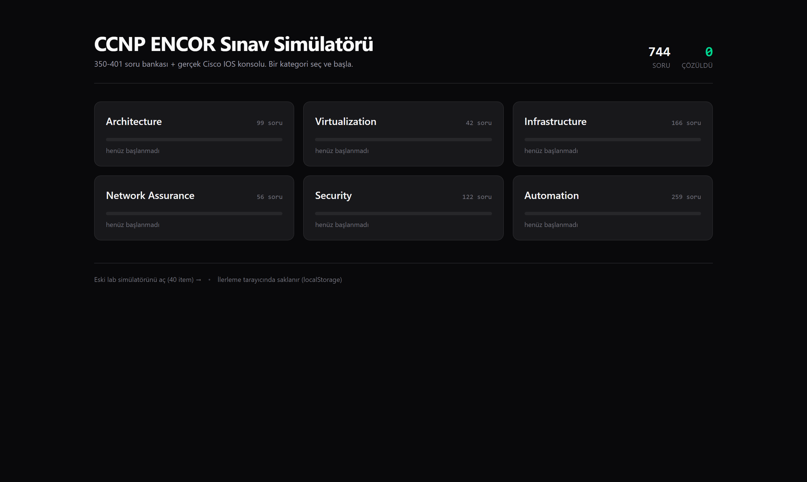
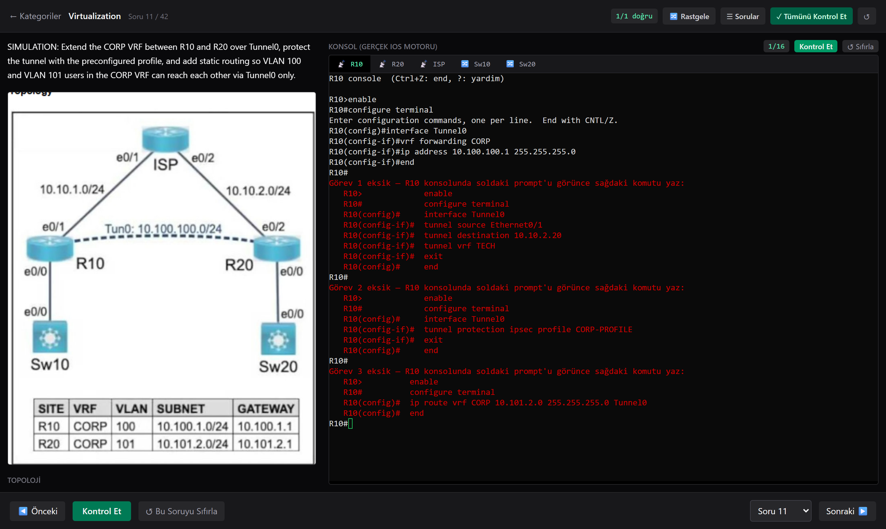
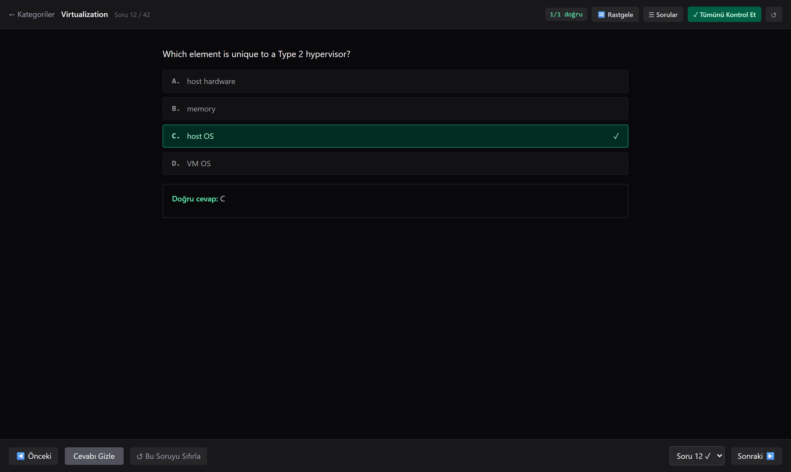
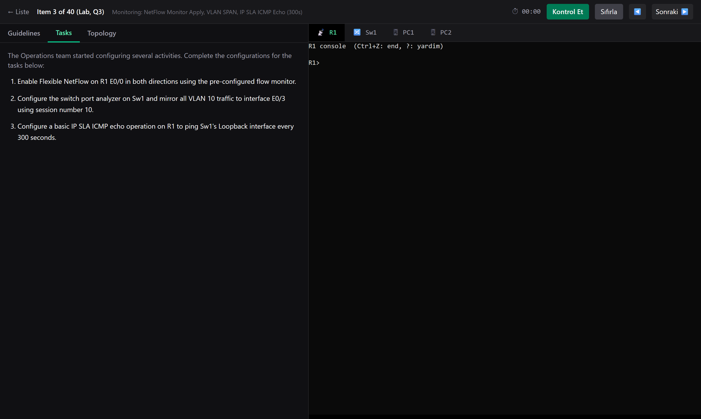

# CCNP ENCOR Sınav Simülatörü

Cisco **350-401 ENCOR** sınavına hazırlık için tarayıcıda çalışan bir soru bankası + **gerçek Cisco IOS konsol emülatörü**.

744 soruyu 6 kategoride çözebilir, SIMULATION tipi sorularda gerçek bir router/switch konsoluna komut yazıp
otomatik puanlama alabilirsin. Veritabanı, Docker veya hesap açma yok — `npm install` + `npm run dev` yeterli.



---

## İçindekiler

- [Özellikler](#özellikler)
- [Kurulum](#kurulum)
- [Kullanım](#kullanım)
- [Ekran görüntüleri](#ekran-görüntüleri)
- [Proje yapısı](#proje-yapısı)
- [Kendi sorunu / lab'ını ekleme](#kendi-sorunu--labını-ekleme)
- [Komutlar](#komutlar)
- [Sık karşılaşılan sorunlar](#sık-karşılaşılan-sorunlar)
- [Bilinen sınırlar](#bilinen-sınırlar)

---

## Özellikler

### Soru bankası (744 soru, 6 kategori)

| Kategori | Soru |
|---|---:|
| Architecture | 99 |
| Virtualization | 42 |
| Infrastructure | 166 |
| Network Assurance | 56 |
| Security | 122 |
| Automation | 259 |

- **3 soru tipi:** çoktan seçmeli (tek/çok cevaplı), sürükle-bırak eşleştirme (`match`) ve konsol laboratuvarı (`lab`).
- **Görseller:** topoloji şemaları, GUI ekran görüntüleri ve CLI çıktıları soruya gömülü. Cevabı sızdıran
  ekran görüntüleri kırpılmıştır.
- **Açıklama + referans:** "Kontrol Et" sonrası doğru cevap, açıklama ve varsa Cisco dokümantasyon linki.

### Çalışma araçları

- **Soru seçici panel** (`☰ Sorular`) — tüm soruları ızgara halinde gösterir; doğru/yanlış/çözülmedi renk kodlu, tıklayınca o soruya atlar.
- **Rastgele mod** (`🔀 Rastgele`) — soruları karıştırır, orijinal soru numaraları korunur.
- **Toplu kontrol** (`✓ Tümünü Kontrol Et`) — cevapladığın tüm soruları tek seferde puanlar.
- **Sıfırlama** — tek soru veya tüm kategori bazında.
- **Kalıcı ilerleme** — `localStorage`'da saklanır, sekmeyi kapatsan da kaybolmaz. Ana ekranda kategori başına
  ilerleme çubuğu ve başarı yüzdesi görünür.

### Gerçek IOS konsol emülatörü

SIMULATION sorularında `xterm.js` tabanlı, backend'de çalışan el yapımı bir Cisco IOS emülatörü var:

- **Mod makinesi:** `R1>` → `R1#` → `R1(config)#` → `R1(config-if)#` … gerçek IOS gibi davranır.
- **`?` bağlamsal yardım** — bulunduğun modda geçerli komutları listeler.
- **`Tab` ile tamamlama** — `conf<Tab>` → `configure terminal`.
- **Kısaltmalar** — `int e0/1` = `interface Ethernet0/1`, `conf t` = `configure terminal`.
- **`no` ile geri alma**, komut geçmişi (`↑`/`↓`), `Ctrl+C`, `Ctrl+Z`.
- **`show` komutları** — `show running-config`, `show ip interface brief`, `show vlan`, `show ip route`,
  `show flow monitor`, `show ip sla`, `show spanning-tree` ve `| include`/`| section` pipe desteği.
- **Desteklenen komut aileleri:** interface/VLAN/trunk, OSPF, EIGRP, BGP (address-family dahil), VRF, GRE tunnel,
  IPsec profile, ACL, CoPP, HSRP/VRRP/GLBP, EtherChannel (LACP), STP, NAT, DHCP, NTP, SNMP, NetFlow, SPAN, IP SLA,
  `ip prefix-list`, UDLD.

### Otomatik puanlama

Değerlendirme **komut dizisine değil, cihazın ulaştığı nihai `running-config` durumuna** göre yapılır.
Yani komut sırası, kısaltmalar ve fazladan doğru satırlar cezalandırılmaz.

`Kontrol Et`'e bastığında eksik kalan yapılandırma, **hangi prompt'ta ne yazacağın** ile birlikte doğrudan
terminale kırmızı yazılır; tamamlanan görevler yeşil onay alır:

```
Görev 1 eksik — R10 konsolunda soldaki prompt'u görünce sağdaki komutu yaz:
   R10>            enable
   R10#            configure terminal
   R10(config)#    interface Tunnel0
   R10(config-if)# tunnel source Ethernet0/1
   R10(config-if)# tunnel destination 10.10.2.20
   R10(config-if)# tunnel vrf TECH
   R10(config-if)# exit
   R10(config)#    end
```

### İki simülatör bir arada

- **Yeni sistem:** kategori bazlı 744 soru (ana ekran).
- **Eski sistem:** 40 adet tam lab item'ı, zamanlayıcı, topoloji görüntüleyici (zoom/pan), modal sonuç raporu ve
  "Resmi Çözümü Göster" özelliğiyle. Ana ekranın altındaki **"Eski lab simülatörünü aç"** bağlantısından erişilir.

---

## Kurulum

### Gereksinimler

| Araç | Sürüm | Not |
|---|---|---|
| [Node.js](https://nodejs.org/) | 18 veya üzeri | `npm` ile birlikte gelir |
| Git | herhangi | repoyu klonlamak için |
| Python 3 | 3.10+ | **isteğe bağlı** — sadece `scripts/` altındaki PDF/görsel araçları için |

Kurulum kontrolü:

```bash
node -v    # v18.x veya üzeri olmalı
npm -v
```

### Adımlar

```bash
# 1) Repoyu klonla ve v2 dalına geç
git clone https://github.com/erenonder0/ccnp-encor-lab-simulator.git
cd ccnp-encor-lab-simulator
git checkout v2

# 2) Bağımlılıkları kur (birkaç dakika sürebilir)
npm install

# 3) Frontend + backend'i birlikte başlat
npm run dev
```

`npm run dev` iki süreci aynı anda çalıştırır:

- **web** → Vite dev sunucusu, http://localhost:5173
- **api** → Express backend, http://localhost:3001

Tarayıcıda **http://localhost:5173** adresini aç. Hepsi bu — kurulum sihirbazı, `.env` dosyası veya veritabanı yok.

> **Windows kullanıcıları:** komutları PowerShell'de çalıştırabilirsin. PowerShell 5.1'de `&&` çalışmaz;
> komutları tek tek veya `;` ile ayırarak gir.

---

## Kullanım

1. Ana ekrandan bir **kategori** seç.
2. Soruyu cevapla → **Kontrol Et**.
   - Çoktan seçmeli: şıklara tıkla (çok cevaplı sorularda birden fazla seçebilirsin).
   - Eşleştirme: her satır için doğru seçeneği aç.
   - **Lab (SIMULATION):** sağdaki konsola gerçek IOS komutlarını yaz.
3. Konsollu sorularda önce **`enable`**, sonra **`configure terminal`** yazmayı unutma — emülatör gerçek
   cihaz gibi mod duyarlıdır. Takıldığında **`?`** yaz veya **`Tab`** ile tamamla.
4. **Kontrol Et** eksikleri kırmızıyla terminale yazar; düzeltip tekrar bas.
5. **↺ Sıfırla** cihaz konfigürasyonlarını başlangıç durumuna döndürür.

İlerlemen otomatik kaydedilir. Sıfırlamak için ana ekrandaki kategori kartına girip sağ üstteki `↺` düğmesini kullan.

---

## Ekran görüntüleri

**Konsollu (SIMULATION) soru — solda topoloji, sağda gerçek IOS terminali:**



**Çoktan seçmeli soru — cevap, açıklama ve referans:**



**Eski 40 item'lık lab simülatörü:**



---

## Proje yapısı

```
├─ data/
│  ├─ questions/*.jsonl      # 6 kategori, satır başına bir soru (744 soru)
│  ├─ labs/*.json            # tam simülasyonlu lab tanımları (kategori-n.json)
│  ├─ items/item-01..40.json # eski sistemin 40 lab item'ı
│  ├─ _schema.json           # eski item'lar için JSON Schema
│  └─ progress.json          # eski sistemin skorları (backend yazar)
├─ server/
│  ├─ index.ts               # Express API
│  ├─ session.ts             # oturum + cihaz durumu
│  ├─ ios/                   # IOS emülatörü (grammar, engine, configTree, show…)
│  ├─ grader/grade.ts        # nihai config durumuna göre puanlama
│  └─ __tests__/             # Vitest testleri
├─ src/
│  ├─ App.tsx                # kategori ana ekranı + yönlendirme
│  ├─ pages/CategoryQuiz.tsx # yeni soru çözme ekranı
│  ├─ pages/Lab.tsx          # eski lab ekranı
│  └─ components/            # Terminal, FullSimLab, TopologyView, GradeReport…
├─ public/assets/questions/  # soru görselleri (kategori bazlı)
└─ scripts/                  # PDF → PNG, topoloji kırpma (Python, isteğe bağlı)
```

**Teknolojiler:** React 18 + TypeScript + Vite + TailwindCSS 4, `@xterm/xterm`, Express, Vitest.
IOS emülatörü ve puanlayıcı tamamen kendi yazdığımız kod — harici bir Cisco imajı veya GNS3 gerekmez.

---

## Kendi sorunu / lab'ını ekleme

### Normal soru

`data/questions/<kategori>.jsonl` dosyasına yeni bir satır ekle (JSON Lines — her satır tek bir JSON):

```json
{"n": 745, "q": "Which protocol does VXLAN use for transport?", "o": {"A": "TCP", "B": "UDP", "C": "GRE", "D": "SCTP"}, "a": ["B"], "e": "VXLAN, MAC-in-UDP kapsüllemesi kullanır.", "r": "https://www.cisco.com/..."}
```

| Alan | Açıklama |
|---|---|
| `n` | soru numarası (kategori içinde benzersiz) |
| `q` | soru metni |
| `type` | `test` (varsayılan), `match` veya `lab` |
| `o` / `a` | şıklar / doğru cevap(lar) — çok cevaplı: `["B","D"]` |
| `e` / `r` | açıklama / referans linki |
| `img` | `public/assets/questions/<kategori>/` altındaki dosya adı |
| `exhibit` | metin tabanlı ek (CLI çıktısı vb.) |
| `pairs` / `options` | `match` tipi için eşleştirme çiftleri |

### Tam simülasyonlu lab

Sorunun `type`'ı `lab` olmalı, ardından `data/labs/<kategori>-<n>.json` dosyasını oluştur.
Örnek için `data/labs/virtualization-11.json` dosyasına bak. Ana bölümler:

- `devices[]` — cihaz adı, tipi (`ios-router` / `ios-switch` / `pc`), fiziksel arayüzler ve `preconfig`
  (girintili ham IOS satırları; öğrencinin karşılaştığı başlangıç durumu).
- `grading.checks[]` — her görev için `device`, `points` ve `required` satırları.
  Her satır bir `path` (örn. `["interface Tunnel0"]`) ve o path altında bulunması gereken `line` içerir.
- `grading.forbidden[]` — yasaklı desenler (regex), örn. hostname değiştirmek.
- `answer_key_raw` — tam çözüm transkripti; **test tarafından otomatik doğrulanır**.
- `hints[]`, `explanation` — ipuçları ve açıklama.

Dosyayı ekledikten sonra:

```bash
npm test
```

`replay.test.ts` her lab dosyasının cevap anahtarını emülatörde çalıştırır ve **tam puan almasını** şart koşar.
Test geçiyorsa lab oynanabilir demektir; hata varsa mesaj hangi komutun tanınmadığını söyler.

---

## Komutlar

```bash
npm run dev          # frontend (5173) + backend (3001) birlikte
npm run dev:web      # sadece Vite
npm run dev:api      # sadece Express API
npm run build        # üretim derlemesi (dist/)
npm test             # Vitest — emülatör, puanlayıcı ve cevap anahtarı testleri (65 test)
npm run validate:items  # eski item'ları JSON Schema'ya göre doğrula
npx tsc --noEmit     # tip kontrolü
```

---

## Sık karşılaşılan sorunlar

**"Backend'e ulaşılamadı" hatası**
API çalışmıyor. `npm run dev` yerine sadece `npm run dev:web` başlatmış olabilirsin; ikisini birlikte çalıştır
ya da ikinci bir terminalde `npm run dev:api` çalıştır.

**5173 veya 3001 portu dolu**
Portu kullanan süreci kapat ya da `vite.config.ts` içindeki `server.port` ve `server/index.ts` içindeki `PORT`
değerlerini değiştir (proxy ayarını da güncellemeyi unutma).

**Terminalde yazdığım komut `% Invalid input detected` diyor**
Büyük ihtimalle yanlış moddasın. Prompt'a bak: `R10>` (user exec) → `enable` → `R10#` (privileged) →
`configure terminal` → `R10(config)#`. `interface`, `ip route` gibi komutlar yalnızca config modunda çalışır.
Hangi komutların geçerli olduğunu görmek için **`?`** yaz.

**`npm install` uzun sürüyor / takılıyor**
Depo görselleri ve `xterm` bağımlılıkları nedeniyle ilk kurulum birkaç dakika sürebilir. Kesilirse
`node_modules` klasörünü silip tekrar dene.

---

## Bilinen sınırlar

- IOS emülatörü **eğitim amaçlıdır**; gerçek bir Cisco cihazının tüm komut setini değil, sınavda geçen
  konuları kapsar. Tanımadığı komuta gerçek cihaz gibi `% Invalid input detected` döner.
- `show ip route vrf X` çıktısı VRF bazlı filtrelenmez (tüm rotaları gösterir).
- Tam simülasyon şu an **sadece `data/labs/` altında dosyası olan sorular** için aktif; diğer lab
  sorularında pratik amaçlı basit bir konsol gösterilir (otomatik puanlama yok).
- Soru bankası bir sınav dökümanından transkribe edilmiştir; hata bulursan issue açabilirsin.

---

## Lisans

Kişisel çalışma/eğitim amaçlı bir projedir. Soru içerikleri ilgili sınav dökümanına aittir.
